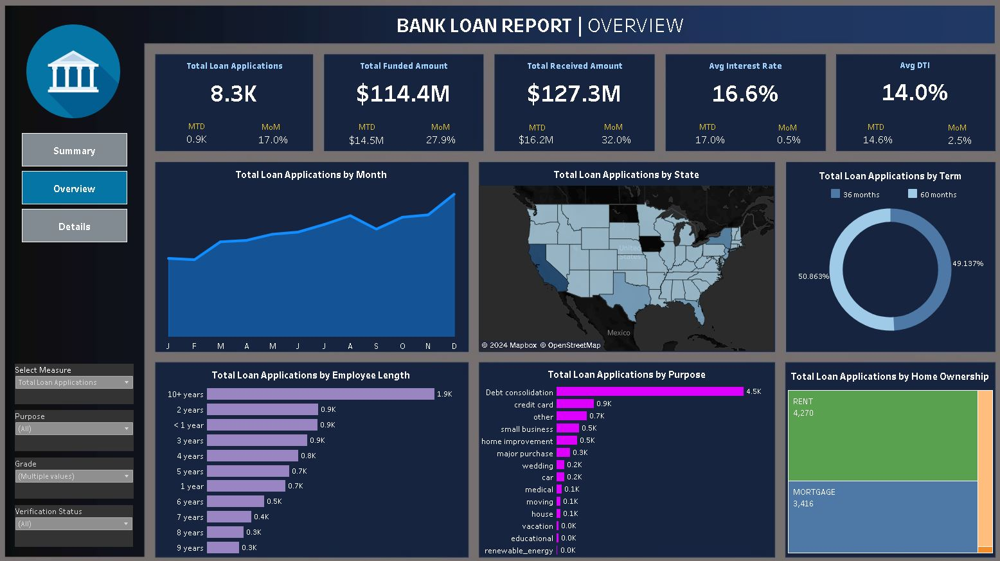

# Bank Loan Analysis Portfolio Project

## Table of Contents

- [Project Overview](#project-overview)
- [Data Sources](#data-sources)
- [Tools Used](#tools-used)
- [Data Cleaning and Preparation](#data-cleaning-and-preparation)
- [Exploratory Data Analysis](#exploratory-data-analysis)
- [Data Analysis](#data-analysis)
- [Results and Findings](#results-and-findings)
- [Recommendations](#recommendations)
- [Limitations](#limitations)

## Project Overview
This project analyzes a bank's loan portfolio to gain insights into key financial metrics and assess the risk associated with different loans. The primary KPIs analyzed are total loan applications, total funded amount, total received amount, average interest rate, and average debt-to-income ratio (DTI). The analysis aims to provide actionable recommendations for improving loan management and decision-making.

Click image to view visualization

## Data Sources
The dataset used in this project includes the following columns:

- **address_state**: State where the borrower resides
- **application_type**: Type of loan application (individual or group)
- **employee_length**: Duration of the borrower's employment
- **employee_title**: Job title of the borrower
- **grade**: Risk classification based on creditworthiness
- **home_ownership**: Indicates if the borrower rents, owns, or has a mortgage
- **issue_date**: Date the loan was issued
- **last_credit_pull**: Date of the last credit check
- **last_payment_date**: Most recent loan payment date
- **loan_status**: Current state of the loan
- **next_payment_date**: Estimated date of the next loan payment
- **purpose**: Reason for the loan
- **sub_grade**: Refined risk assessment within a grade
- **term**: Duration of the loan
- **verification_status**: Indicates if the borrower's financial information has been verified
- **annual_income**: Borrower's yearly earnings
- **DTI (Debt to Income Ratio)**: Measures the borrower's capacity to take on additional debt
- **installment**: Fixed payment amount for loan repayment
- **interest_rate**: Rate charged on the loan
- **loan_amount**: Total amount of the loan
- **total_amount_paid**: Total amount repaid by the borrower

## Tools Used
- **Excel**: For data cleaning, preparation, and preliminary analysis.
- **SQL**: For querying and managing the data.
- **Tableau**: For data visualization and dashboard creation.

## Data Cleaning and Preparation
The dataset underwent several cleaning steps to ensure accuracy and consistency:
- **Duplicate Removal**: Identified and removed duplicate records.
- **Missing Values**: Handled missing data by using appropriate imputation techniques or removing incomplete records.
- **Standardization**: Standardized categorical variables and converted dates to a consistent format.
- **Derived Metrics**: Calculated additional metrics such as total funded amount and total received amount.

## Exploratory Data Analysis
During the EDA phase, the data was thoroughly examined to identify patterns, trends, and relationships between variables:
- **Distribution Analysis**: Analyzed the distribution of loan amounts, interest rates, and DTI ratios.
- **Correlation Analysis**: Investigated the correlation between variables like employment length, home ownership, and grade on loan status.
- **Trend Visualization**: Visualized time-based trends in loan issuance, payments, and defaults.

## Data Analysis
The analysis focused on evaluating key performance indicators:
- **Total Loan Applications**: Counted all loan applications in the dataset.
- **Total Funded Amount**: Summed the funded loan amounts.
- **Total Received Amount**: Calculated the total amount received by the bank through repayments.
- **Average Interest Rate**: Computed the mean interest rate across all loans.
- **Average Debt-to-Income Ratio (DTI)**: Calculated the average DTI ratio for all borrowers.

## Results and Findings
Key insights from the analysis include:
- **High-Risk Loans**: Loans with higher interest rates and lower grades showed a higher default rate.
- **Geographical Trends**: Certain states exhibited higher loan application volumes and lower default rates, indicating regional differences in loan performance.
- **Income vs. Loan Amount**: Borrowers with higher annual incomes tend to secure larger loan amounts but at lower interest rates.

## Recommendations
Based on the analysis, the following recommendations are made:
- **Tighten Loan Approval Criteria**: Consider stricter approval criteria for loans with higher interest rates and lower grades to reduce default risk.
- **Focus on High-Performing Regions**: Expand marketing efforts in states with lower default rates to capitalize on regional strengths.
- **Customized Loan Products**: Develop tailored loan products for high-income borrowers with competitive interest rates to attract more business.

## Limitations
This analysis has some limitations:
- **Dataset Limitations**: The dataset may not fully represent all loan types or regions, potentially biasing the analysis.
- **Assumptions**: Certain assumptions were made during data cleaning and analysis that may impact the results.
- **External Factors**: Economic conditions and external factors were not considered, which may influence loan performance.

---

[**Link to visualization**](https://public.tableau.com/app/profile/cody.stoerck/viz/BankLoanAnalysisDashboard_17091319168180/SUMMARY)

